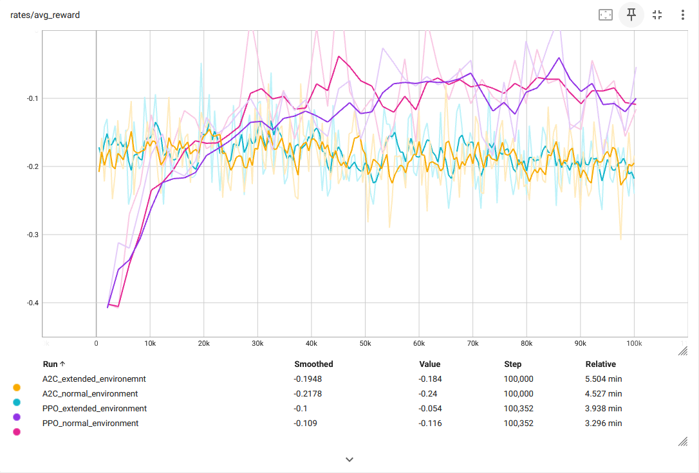

# Blackjack

## Team Members:
* Kaden Hart
* Logan Liddiard
* Arash Azizian Foumani


## Project Overview

This project focuses on applying the algorithms focusing on uncertainty across the game Blackjack scenarios. There were three main parts:

1. Exploring the use of optimal stopping algorithms in blackjack
2. Determining if the epsilon-greedy and thompson sampling algorithm can find the optimal table to play at (with different #decks)
3. Seeing if reinforcement learning algorithms can find improved strategies

## Requirements:

* Python 3.11
  * Required packages: `numpy`, `scipy`, `matplotlib`, `seaborn`, `stable_baselines3`, `gymnasium`,`tensorboard`
  These can be installed by running:
```
pip install -r requirements.txt
```

## How to run:

The main python file for submission is `main.py`

While inside the same directory as `main.py` run:

`python main.py`


## Optimal Stop

### When to stop hitting?

We had this algorithm play 100,000 rounds of blackjack for each point it could stop on (1-20) using an optimal strategy and tried to find the optimal point to hitting on was

Through the different runs of this algoritm most often it was a fight between 15 and 16. This disproves the beleive that  some people think the optimal point to stop hitting on is, which is 12 in a lot of cases

<p align="center">
  
</p>


### When to leave the table?

We had this algorithm play 1000 rounds of blackjack using an optimal strategy and tried to find the optimal point to stop exploring was.

Across different runs of this algorithm the common theme amongst them is to stop exploring sooner rather than later. The optimal point to stop exploring and leave when you either break even or surpass your maximum amount seems to be around round 50-100. The longer you play the more you ned up losing on average as seen in the graph below.


<p align="center">
  
</p>

### Which table is the best? Do different amounts of decks matter?

We used Thompson sampling and an epsilon greedy algorithm to explore tables with different amounts of decks. We tested epsilon values of [0.01, 0.05, 0.1, 0.4], and deck sizes of [1, 2, 4, 6, 8]. We let it run for 1000 episodes/games, and then averaged the results over 1000 iterations.

<p align="center">
  
</p>

Every epsilon value/thompson sampling and deck combination converged in similar amounts of time and to very similar win ratios. Thompson sampling seems to have converged the fastest. There is about a ~0.5% spread in win ratios in all of the deck and technique combinations. Our plot indicates that the epsilon of 0.4 seems to have the highest converged win ratio, whole e=0.1 was the lowest. thompson sampling did the same as e=.05 & e=.1. However, most if not all of this variability could be explained by not running enough iterations, but it would take a very long time to run significantly higher amounts.

<p align="center">
  
</p>

We averaged the amount of wins for each deck across all runs. Each deck performed exactly the same. It is apparent that having different amounts of decks does not effect winning chances by typical strategies. Higher amounts of decks are most likely just to discourage card counting, which is considered cheating. These results aren't surprising to us, because each deck count will have the same proportion of all cards.

### How many decks is most profitable? Which strategy for exploring is best?

The results are all very close, it seems like the number of decks doesn't effect profitability with typical strategies, but probably make card counting much harder to do. Our plot shows the epsilon greedy e=.4 is the best strategy, however, this is almost certainly an artifact of not doing enough runs, because the win probabilities of each table seem to be exactly the same. Using higher iterations would make each technique converge to closer values, but this would take forever to run, at least on our cpus single-threaded.

# Reinforcement Learning

We trained A2C and PPO algorithms on two Blackjack environments. In one environment, the agent could only observe its current hand and the dealer's current hand. In the second environment, the agent could also observe the remaining cards in the deck. The goal was to determine whether access to additional information would influence the agent's decisions. The environments were implemented using `gymnasium.Env`.

## Environment details
### Action Space
The action space is of shape `(1,)` and includes two possible actions:
- `0`: Stick
- `1`: Hit

### Observation Space
#### Observing Only Player and Dealer Hands (Normal environment)
The observation space consists of a list of 26 numbers:
- The first 13 numbers represent the player's hand.
- The second 13 numbers represent the dealer's hand.

For example, if the player's hand consists of `3 of Hearts`, `3 of Spades`, `2 of Diamonds`, and `Jack of Diamonds`, the first 13 numbers would be:

| 2 | 3 | 4 | 5 | 6 | 7 | 8 | 9 | 10 | J | Q | K | A |
|---|---|---|---|---|---|---|---|----|---|---|---|---|
| 1 | 2 | 0 | 0 | 0 | 0 | 0 | 0 | 0  | 1 | 0 | 0 | 0 |

If the dealer's hand contains only the `Ace of Hearts`, the second 13 numbers would be:

| 2 | 3 | 4 | 5 | 6 | 7 | 8 | 9 | 10 | J | Q | K | A |
|---|---|---|---|---|---|---|---|----|---|---|---|---|
| 0 | 0 | 0 | 0 | 0 | 0 | 0 | 0 |  0 | 0 | 0 | 0 | 1 |

#### Observing Remaining Cards (Extended environment)

If the observation space is extended to include the cards that have not yet been played, an additional 13 numbers are added. These represent the remaining cards in the deck. For example, if the above hands were dealt from a single deck, the remaining cards would be:

| 2  | 3  | 4  | 5  | 6  | 7  | 8  | 9  | 10 | J  | Q  | K  | A  |
|----|----|----|----|----|----|----|----|----|----|----|----|----|
| 3  | 2  | 4  | 4  | 4  | 4  | 4  | 4  | 4  | 3  | 4  | 4  | 3  |

### Rewards
- Win the game: **+1**
- Lose the game: **-1**
- Draw the game: **0**

### Episode Termination
An episode ends if:
- The agent hits and the sum of its hand exceeds 21.
- The agent chooses to stick.

## Training
Training was conducted for 100,000 iterations.

## Comparison between Algorithms

<p align="center">
  
</p>

The graph above shows the average rewards for the last 500 hands played by each algorithm. The faded line represents the raw data, while the darker line represents a smoothed version. 

Some intervals show average rewards exceeding 0, but this is likely due to noise, as the smoothed line never goes above 0. The PPO algorithm achieved a higher average reward (~ -0.1) compared to A2C (~ -0.2). Interestingly, there was no difference observed between the two environments.

This result was surprising, as having access to information about the remaining cards should theoretically provide an advantage (e.g., via card counting). However, this is likely because the environment does not fully implement the rules of Blackjack, such as splits, 1.5x payouts for natural Blackjacks, or betting. If the agent could place bets, it might leverage the extra information and find opportune hands to place large bets and make a profit.

Another potential limitation is the size of the Multi-Layered Perceptron used in `stable_baselines3`, which might not be large enough to utilize the additional information effectively.


<p align="center">
  
</p>

The graph above shows the loss rate for each algorithm. The loss rate for PPO hovers around 50%, while for A2C, it is approximately 57%.


<p align="center">
  
</p>

The win rate graph indicates that the sum of win and loss rates does not equal 1, as draws are also possible. PPO achieved a win rate of ~42%, compared to ~38% for A2C.

| Algorithm | Average Reward | Win Rate | Loss Rate |
|-----------|----------------|----------|-----------|
| A2C       | ~ -0.2         | ~ 38%    | ~ 57%     |
| PPO       | ~ -0.1         | ~ 42%    | ~ 50%     |


## Example of agent (PPO in extended environment) playing 10 hands


Below is an example of 10 hands played by a PPO agent in the extended environment. Notably, the agent often refrains from hitting more than once, leading to suboptimal decisions. For instance, in one game, the agent's hand (`[6 of Clubs, 2 of Diamonds, 2 of Hearts]`) is a good hand for hitting, but the agent chose to stick and lost the round. With more training or a more sophisticated model, the algorithms might achieve better results.

```text

------------------------------------------------------
start | dealer hand: [('10', 'Spades')] | player hand: [('8', 'Hearts'), ('9', 'Clubs')]
hit   | dealer hand: [('10', 'Spades')] | player hand: [('8', 'Hearts'), ('9', 'Clubs'), ('6', 'Spades')]
Player lost this round.
------------------------------------------------------
start | dealer hand: [('3', 'Diamonds')] | player hand: [('4', 'Clubs'), ('5', 'Diamonds')]
hit   | dealer hand: [('3', 'Diamonds')] | player hand: [('4', 'Clubs'), ('5', 'Diamonds'), ('K', 'Spades')]
stand | dealer hand: [('3', 'Diamonds'), ('9', 'Diamonds'), ('2', 'Spades'), ('4', 'Diamonds')] | player hand: [('4', 'Clubs'), ('5', 'Diamonds'), ('K', 'Spades')]
Player won this round.
------------------------------------------------------
start | dealer hand: [('Q', 'Spades')] | player hand: [('3', 'Spades'), ('9', 'Hearts')]
hit   | dealer hand: [('Q', 'Spades')] | player hand: [('3', 'Spades'), ('9', 'Hearts'), ('A', 'Spades')]
stand | dealer hand: [('Q', 'Spades'), ('7', 'Diamonds')] | player hand: [('3', 'Spades'), ('9', 'Hearts'), ('A', 'Spades')]
Player lost this round.
------------------------------------------------------
start | dealer hand: [('4', 'Hearts')] | player hand: [('A', 'Hearts'), ('6', 'Hearts')]
stand | dealer hand: [('4', 'Hearts'), ('Q', 'Diamonds'), ('K', 'Hearts')] | player hand: [('A', 'Hearts'), ('6', 'Hearts')]
Player won this round.
------------------------------------------------------
start | dealer hand: [('K', 'Diamonds')] | player hand: [('8', 'Spades'), ('J', 'Hearts')]
stand | dealer hand: [('K', 'Diamonds'), ('10', 'Diamonds')] | player hand: [('8', 'Spades'), ('J', 'Hearts')]
Player lost this round.
------------------------------------------------------
start | dealer hand: [('7', 'Spades')] | player hand: [('6', 'Diamonds'), ('8', 'Diamonds')]
hit   | dealer hand: [('7', 'Spades')] | player hand: [('6', 'Diamonds'), ('8', 'Diamonds'), ('10', 'Hearts')]
Player lost this round.
------------------------------------------------------
start | dealer hand: [('3', 'Clubs')] | player hand: [('6', 'Clubs'), ('2', 'Diamonds')]
hit   | dealer hand: [('3', 'Clubs')] | player hand: [('6', 'Clubs'), ('2', 'Diamonds'), ('2', 'Hearts')]
stand | dealer hand: [('3', 'Clubs'), ('A', 'Clubs'), ('3', 'Hearts')] | player hand: [('6', 'Clubs'), ('2', 'Diamonds'), ('2', 'Hearts')]
Player lost this round.
------------------------------------------------------
start | dealer hand: [('Q', 'Hearts')] | player hand: [('J', 'Diamonds'), ('A', 'Diamonds')]
stand | dealer hand: [('Q', 'Hearts'), ('4', 'Spades'), ('J', 'Clubs')] | player hand: [('J', 'Diamonds'), ('A', 'Diamonds')]
Player won this round.
------------------------------------------------------
start | dealer hand: [('J', 'Spades')] | player hand: [('Q', 'Clubs'), ('8', 'Clubs')]
hit   | dealer hand: [('J', 'Spades')] | player hand: [('Q', 'Clubs'), ('8', 'Clubs'), ('9', 'Spades')]
Player lost this round.
------------------------------------------------------
start | dealer hand: [('7', 'Hearts')] | player hand: [('5', 'Clubs'), ('K', 'Clubs')]
hit   | dealer hand: [('7', 'Hearts')] | player hand: [('5', 'Clubs'), ('K', 'Clubs'), ('5', 'Spades')]
stand | dealer hand: [('7', 'Hearts'), ('Q', 'Diamonds')] | player hand: [('5', 'Clubs'), ('K', 'Clubs'), ('5', 'Spades')]
Player won this round.
```

