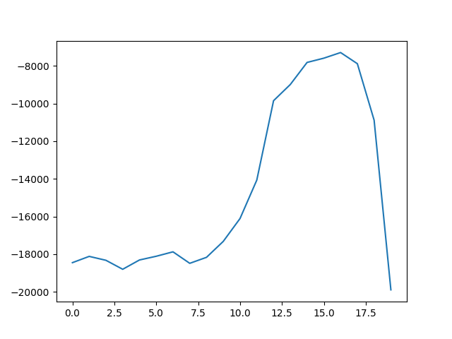

# Blackjack

## Team Members:
* Kaden Hart
* Logan Liddiard


## Project Overview

This project focuses on applying the algorithms focusing on uncertainty across the game Blackjack scenarios. There were three main parts:

1. Exploring the use of optimal stopping algorithms in blackjack
2. Determining if the epsilon-greedy and thompson sampling algorithm can find the optimal table to play at (with different #decks)
3. Seeing if reinforcement learning algorithms can find improved strategies

## Requirements:

* Python 3.x
* Required packages: `numpy`, `scipy`, `matplotlib`, `seaborn`
These can be installed by running:
```
pip install numpy scipy matplotlib seaborn
```

## How to run:

The main python file for submission is `main.py`


## Optimal Stop

### When to stop hitting?

We had this algorithm play 100,000 rounds of blackjack for each point it could stop on (1-20) using an optimal strategy and tried to find the optimal point to hitting on was

Through the different runs of this algoritm most often it was a fight between 15 and 16. This disproves the beleive that  some people think the optimal point to stop hitting on is, which is 12 in a lot of cases

<p align="center">
  
</p>


### When to leave the table?

We had this algorithm play 1000 rounds of blackjack using an optimal strategy and tried to find the optimal point to stop exploring was.

Across different runs of this algorithm the common theme amongst them is to stop exploring sooner rather than later. The optimal point to stop exploring and leave when you either break even or surpass your maximum amount seems to be around round 50-100. The longer you play the more you ned up losing on average as seen in the graph below.


<p align="center">
  
</p>

### Which table is the best? Do different amounts of decks matter?

We used Thompson sampling and an epsilon greedy algorithm to explore tables with different amounts of decks. We tested epsilon values of [0.01, 0.05, 0.1, 0.4], and deck sizes of [1, 2, 4, 6, 8]. We let it run for 1000 epsiodes/games, and then averaged the results over 100 iterations.

<p align="center">
  
</p>

Every epsilon value/thompson sampling and deck combination converged in similar amounts of time (at first glance at least, this deviates when we average the technique's results) and to very similar win ratios. There is about a ~2% spread in win ratios in all of the deck and technique combinations.

<p align="center">
  
</p>

We averaged out the win rates for each epsilon value and for thompson sampling, and its clear that thompson sampling took the longest to converge, but overall probably had the best win rate by a thin margin, edged out slightly by e=.05 at the end. There were slight variations in the convergences for epsilons. Epsilon of .05 took the longest to converge, and the epsilon of .4 was the shortest. After converging, the values all were less than 1% total win ratio different than eachother. 

<p align="center">
  
</p>

We also plotted each deck's results using their individually best strategies. There was slightly more spread in these results than by comparing the different techniques in exploring. Using 1 deck took the longest to converge, possibly because running without immediate replacement has more of an effect when less cards are in total circulation. In our results there was a total spread of ~1% of total win ratio. The best deck amount with it's best strategy for exploring seems to just barely be 1 deck. This best strategy seemed to be thompson sampling as shown: 

<p align="center">
  
</p>

### How many decks is most profitable? Which strategy for exploring is best?

The results are all very close, but it seems like using 1 deck may just barely be more profitable overall. This could just be a skew, we may find different results from running for more iterations. The best strategy seems to be thompson sampling, it takes longer to converge, but typically seems to converge at a slightly higher win rate.